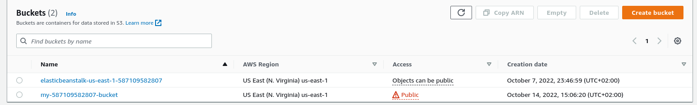
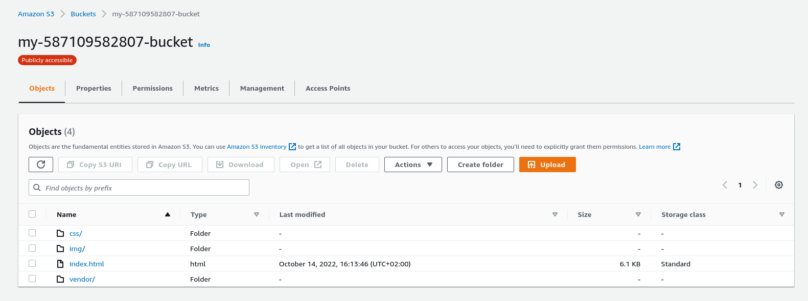

# Deploying-static-website-on-AWS
Hosting a static website using S3 and Accessing cached website data using CloudFront.

## Creating S3 bucket:
1 - Clicking on "Create Bucket" button:<br>
2 - Bucket configuration:<br>
3 - Bucket is created:<br>

<br>


## Uploading files to the bucket:
<br>

## Adding bucket policy:
```
{
    "Version": "2012-10-17",
    "Statement": [
        {
            "Sid": "AddPerm",
            "Effect": "Allow",
            "Principal": "*",
            "Action": "s3:GetObject",
            "Resource": "arn:aws:s3:::my-587109582807-bucket/*"
        }
    ]
}
```

## Distribute Website via CloudFront:

1 - Created new distribution<br>
2 - Added the origin domain<br>
3 - Added the default cache behaviour<br>

## Accessing Website:

1 - [CloudFront domain name](https://d20kqnrmklkk35.cloudfront.net/)<br>
2 - [website-endpoint](http://my-587109582807-bucket.s3-website-us-east-1.amazonaws.com/)<br>
3 - [S3 object URL](https://my-587109582807-bucket.s3.amazonaws.com/index.html)<br>

<br>
