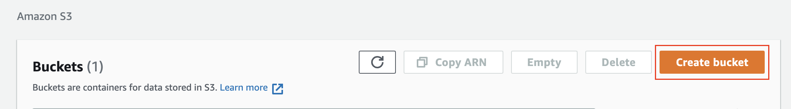
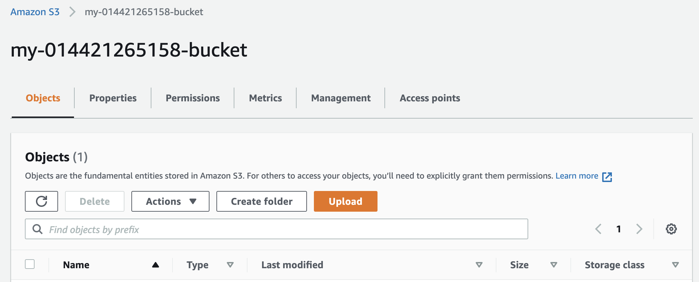
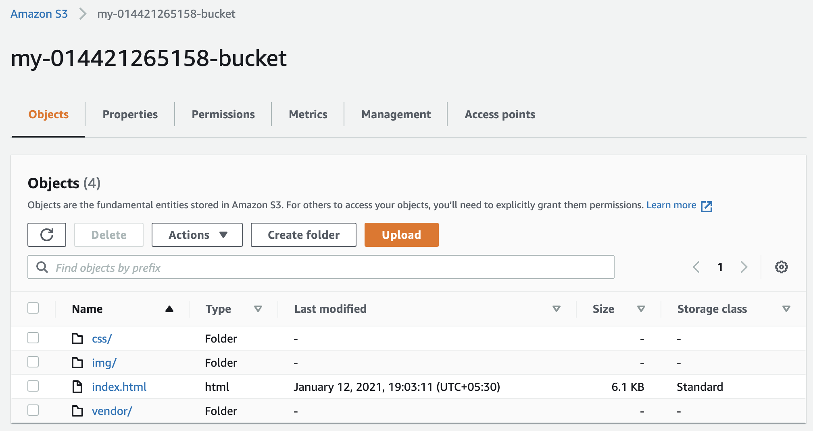

# Deploying-static-website-on-AWS
Hosting a static website using S3 and Accessing cached website data using CloudFront.

## Creating S3 bucket:
1 - Clicking on "Create Bucket" button:<br>
<br>

2 - Bucket configuration:<br>
<br>

3 - Bucket is created:<br>
<br>

## Uploading files to the bucket:
<br>

## Adding bucket policy:
```
{
    "Version": "2012-10-17",
    "Statement": [
        {
            "Sid": "AddPerm",
            "Effect": "Allow",
            "Principal": "*",
            "Action": "s3:GetObject",
            "Resource": "arn:aws:s3:::my-587109582807-bucket/*"
        }
    ]
}
```

## Distribute Website via CloudFront:

1 - Created new distribution<br>
2 - Added the origin domain<br>
3 - Added the default cache behaviour<br>
